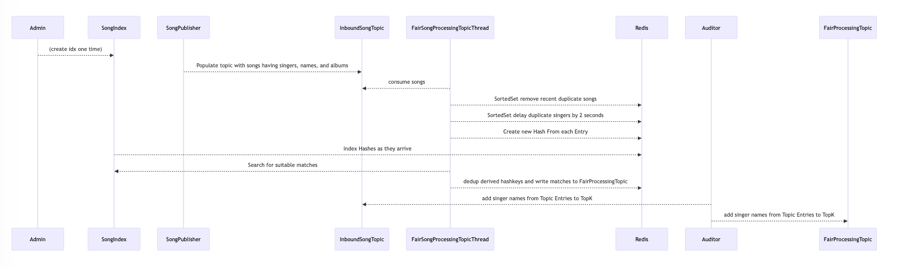

This project demonstrates using Redis Streams and Search and SortedSets to solve the problem of fairly processing events across a range of groupings.

This project also uses the TimeSeries and TopK datatypes to track the arrival time, processing rate, and count for each singer grouping.

* here are some queries for the TimeSeries datatype:
NB: These keys only get generated when you pass --converttofair true
```
TS.MRANGE - + AGGREGATION count 60000 FILTER sharedlabel=fair_events GROUPBY uid reduce avg
```
```
TS.MRANGE - + AGGREGATION count 6000 FILTER sharedlabel=fair_events GROUPBY uid reduce avg
```
```
TS.MRANGE - + AGGREGATION count 1000 FILTER sharedlabel=fair_events GROUPBY uid reduce avg
```

* and here are queries against the TopK datatype:
NB: these keys only get populated when you pass --audittopics true

```
TOPK.LIST TK:singer:InboundSongsTopic withcount
```

```
TOPK.LIST TK:singer:FairProcessingTopic withcount
```

The goal is to minimize the chance that one grouping grabs the lion's share of processing time at the expense of other groupings.

The premise of this project is the following:
Imagine you have incoming songs that need to be 'processed' in some way.
The songs are grouped by singer and album.
The goal is to ensure that one singer or album does not get an unfair amount of processing as compared to the others.
* There will always be at most 15 singers,
* 100 albums per singer,
* and at most 1,000 songs per album.

To run the program you will need a Redis instance with the following modules enabled:
Bloom, Search, TimeSeries

You can spin up a free redis database with these capabilities in the cloud here:  https://redis.io/try-free/

This example includes a Java library that enables the Topic abstraction.

* Execute the mvn command with necessary args to connect to your Redis instance
``` 
 * possible args:
 * --publishnew   true/false should this program execution write new song entries?
 * --eventcount 100  int how many events to process (including new entries or audited entries)
 * --converttofair  true/false should this program execution populate the FairTopic with songs? 
 * --convertthreadnum  int how many threads to spin up that do the converting to FairTopic?
 * --convertcount   int how many entries should each thread process before exiting?
 * --audittopics  true/false should thie program execution create topK entries showing entry counts by singer? 
 *
```

It makes sense to execute the program multiple times - the logical path is to:
1. Produce new songs
2. Convert them into searchable Hashes and populate the FairTopic
3. Audit the count of songs seen in Inbound and Fair topics


Note that some rare songs do get throttled and therefore never get added to the FairTopic
You can check on these songs by executing the following search query in RedisInsight:

```
FT.SEARCH idx_songs "@isThrottled:{true}" return 2 singer album
```



* Example with all required args publishing only new Song entries:
```
mvn compile exec:java -Dexec.cleanupDaemonThreads=false -Dexec.args="--host redis-FIXME.com --port 0000 --password FIXME --converttofair false --audittopics false --publishnew true --eventcount 1500"
```
* Example with all required args converting Song entries to FairEntries:
```
mvn compile exec:java -Dexec.cleanupDaemonThreads=false -Dexec.args="--host redis-FIXME.com --port 0000 --password FIXME --audittopics false --publishnew false --converttofair true --convertcount 150 --convertthreadnum 10"
```
* Example with all required args producing topK results from INBOUND and FAIR Topics:
```
mvn compile exec:java -Dexec.cleanupDaemonThreads=false -Dexec.args="--host redis-FIXME.com --port 0000 --password FIXME --publishnew false --converttofair false --audittopics true --eventcount 1500"
```

* It is expected that the Search module is enabled and the following index has been created...
* Execute the following from redis-cli / redisInsight to create the necessary index:
```
FT.CREATE idx_songs prefix 1 song SCHEMA singer TAG SORTABLE album TAG SORTABLE isTombstoned TAG isQueued TAG isThrottled TAG TimeOfArrival NUMERIC SORTABLE
```

Note that to build this project you need to add the necessary jar to your local mvn repo:

This will not be necessary once this libray is available publicly through mvn 

``` 
mvn org.apache.maven.plugins:maven-install-plugin:2.5.2:install-file -Dfile=redis-streams-java-0.3.1.2.jar
```