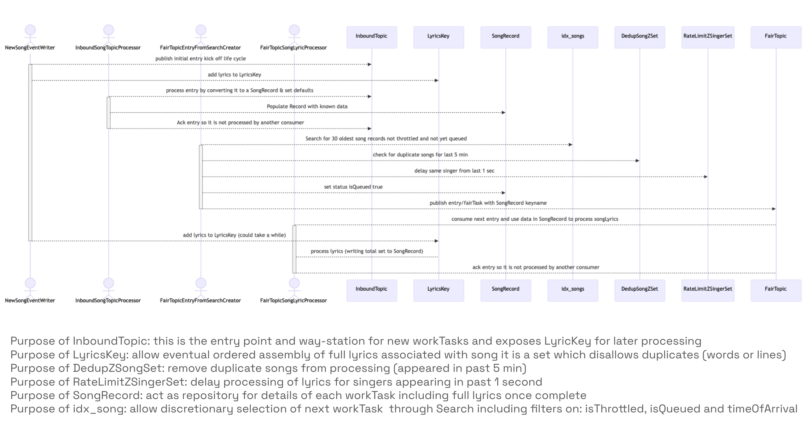
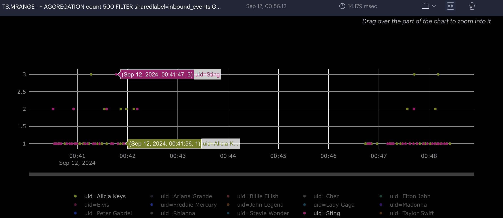

## This project demonstrates using Redis Streams and Search and SortedSets to solve the problem of fairly processing events across a range of groupings.

### Note that by:
### * using Streams, all the worker processing is recoverable and scalable and durable
### * using search, variable filters can be chosen to enable future processing decisions based on isThrottled, or isTombstoned, releaseDate or whatever attributes prove useful
### * using timeSeries, it is easy to see the impact of the rate limiting and filtering in the effort to establish fairness


This project also (somewhat frivolously) uses the TopK datatype to track the count for each singer grouping.

### A simple diagram that steps through the life cycle of the song processing:


### A workflow diagram that steps through the life cycle of the song processing:



## Thoughts on Fairness

This solution focuses on a push model where the incoming songs drive the processing rate.
Behind the scenes, the rate at which the incoming songs arrive is influenced by unknown forces.  (the arguments you provide to this program)

By looking at the same singer-related tasks arrival times and frequency in both the Inbound and Fair Topics, you can see the impact of the patterns employed by this solution.

* This first screenshot shows several instances of Sting and Alicia Keys having 3 and 2 songs published in the same 500 millis time window:  
<em>a bit further down in this document you will see the same query against the FairTopic for Sting and Alicia Keys</em>



#### here is a query that reveals the rate of inbound tasks being added to the system for Sting and Elvis:

```
TS.MRANGE - + AGGREGATION count 500 FILTER sharedlabel=inbound_events uid=(Elvis,Sting) GROUPBY uid reduce avg
```

* the following queries target the inbound_events data (these keys are created when you publish/produce entries):

```
TS.MRANGE - + AGGREGATION count 60000 FILTER sharedlabel=inbound_events GROUPBY uid reduce avg
```

```
TS.MRANGE - + AGGREGATION count 6000 FILTER sharedlabel=inbound_events GROUPBY uid reduce avg
```

```
TS.MRANGE - + AGGREGATION count 1000 FILTER sharedlabel=inbound_events GROUPBY uid reduce avg
```
* here are some queries for the TimeSeries datatype:
NB: These keys only get generated when you pass --converttofair true

* Notice that (due to the work done by this solution) in this screenshot there are fewer instances of Sting and Alicia Keys having 3 and 2 songs presented for processing in the same 500 millis time window:
Success!  a more fair distribution of the incoming songs!


#### here is a query that reveals the rate of fair tasks being added to the system for Sting and Elvis:

```
TS.MRANGE - + AGGREGATION count 500 FILTER sharedlabel=fair_events uid=(Elvis,Sting) GROUPBY uid reduce avg
```

```
TS.MRANGE - + AGGREGATION count 60000 FILTER sharedlabel=fair_events GROUPBY uid reduce avg
```

```
TS.MRANGE - + AGGREGATION count 6000 FILTER sharedlabel=fair_events GROUPBY uid reduce avg
```

```
TS.MRANGE - + AGGREGATION count 1000 FILTER sharedlabel=fair_events GROUPBY uid reduce avg
```

* and here are queries against the TopK datatype:
NB: these keys only get populated when you pass --audittopics true

```
TOPK.LIST TK:singer:InboundSongsTopic withcount
```

```
TOPK.LIST TK:singer:FairProcessingTopic withcount
```

The goal is to minimize the chance that one grouping grabs the lion's share of processing time at the expense of other groupings.

The premise of this project is the following:
Imagine you have incoming songs that need to be 'processed' in some way.
The songs are grouped by singer and album.
The goal is to ensure that one singer or album does not get an unfair amount of processing as compared to the others.
* There will always be at most 15 singers,
* 100 albums per singer,
* and at most 1,000 songs per album.

To run the program you will need a Redis instance with the following modules enabled:
Bloom, Search, TimeSeries

You can spin up a free redis database with these capabilities in the cloud here:  https://redis.io/try-free/

This example includes a Java library that enables the Topic abstraction.

* Execute the mvn command with necessary args to connect to your Redis instance

``` 
 * possible args:
 * --publishnew   true/false should this program execution write new song entries?
 * --eventcount 100  int how many events to process (including new entries or audited entries)
 * --converttofair  true/false should this program execution populate the FairTopic with songs? 
 * --convertthreadnum  int how many threads to spin up that do the converting to Hashes?
 * --searchwritethreadnum in how many threads to spin up that search and write new entries to the FairTopic?
 * --convertcount   int how many entries should each search thread process before exiting?
 * --audittopics  true/false should thie program execution create topK entries showing entry counts by singer? 
 * --processlyricsthreadcount 2 how many threads to spin up to process lyrics 
 * --processlyrics true true/false should this program process lyrics - adding them to song Records?
```

* Example start command to Produce song entries, convert them to records, make them visible in the FairTopic and  have the lyrics processed:

```
mvn compile exec:java -Dexec.cleanupDaemonThreads=false -Dexec.args="--host redis-FIXME.com --port 0000 --password FIXME --publishnew true --converttofair true --convertcount 25 --audittopics false --convertthreadnum 4 --searchwritethreadnum 2 --eventcount 20 --publishthreadnum 5 --processlyricsthreadcount 2 --processlyrics true"
```
This ^ sort of run is pretty noisy, as all the operations happen in the same VM and the shell gets to be full of activity reported by the various Threads...

It is also possible to execute the program multiple times in separate VMs - the logical path is to:
1. Produce new songs
2. Convert them into searchable Hashes 
3. Populate the FairTopic
4. Process the lyrics   
5. (optional) Audit the count of songs seen in Inbound and Fair topics


* It is expected that the Search module is enabled and the following index has been created...
* Execute the following from redis-cli / redisInsight to create the necessary index:
```
FT.CREATE idx_songs prefix 1 song SCHEMA singer TAG SORTABLE album TAG SORTABLE isTombstoned TAG isQueued TAG isThrottled TAG TimeOfArrival NUMERIC SORTABLE
```

You can run your own search queries to see what is in the data:
```
FT.AGGREGATE idx_songs "@isQueued:{false} @isThrottled:{false} @isTombstoned:{false}" LOAD 2 @__key @TimeOfArrival GROUPBY 3 @__key @singer @album REDUCE MAX 1 TimeOfArrival AS TOA SORTBY 2 @TOA ASC LIMIT 0 10 DIALECT 2
```
You can confirm if there are any Throttled songs by executing the following search query in RedisInsight:

```
FT.SEARCH idx_songs "@isThrottled:{true}" return 2 singer album
```
<em>Note that (as of Sept 24th 2024) throttling is not enabled yet. Feel free to manually edit one of the Song records isThrottled attributes and you will see the impact on the search query...</em>


Note that to build this project you need to add the necessary jar to your local mvn repo:

This will not be necessary once this libray is available publicly through mvn (expected in late 2024)

``` 
mvn org.apache.maven.plugins:maven-install-plugin:2.5.2:install-file -Dfile=redis-streams-java-0.3.1.2.jar
```